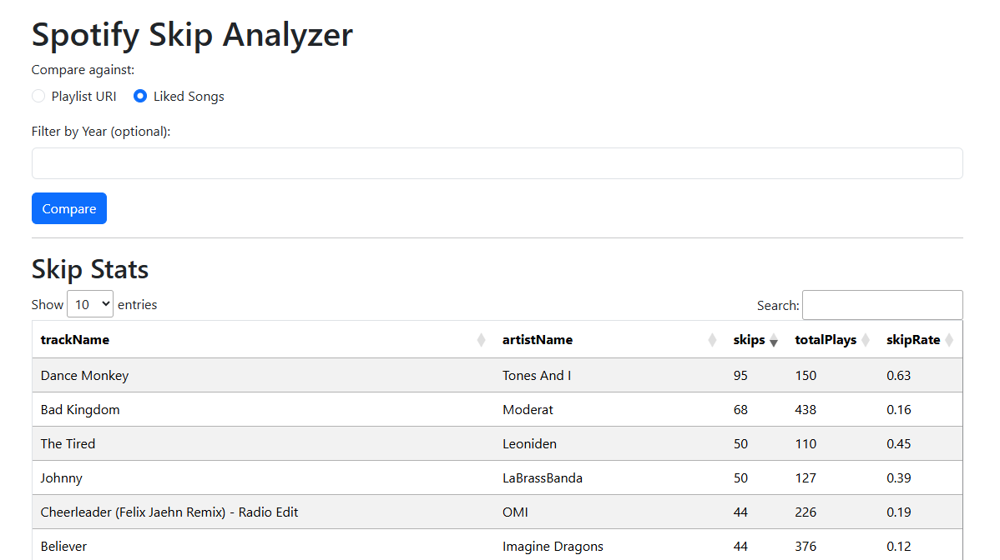

# 🎵 Spotify Skip Stats Viewer

A Flask web app that analyzes your **Spotify Streaming History** and shows how often tracks are skipped.  
You can compare this to:
- **A specific playlist** (by Spotify URI)
- **Your liked songs**
- Filter results by **year**
- View results in a sortable, searchable table

---
## 📸 Screenshots


---

## 📦 Features
- Load Spotify Extended Streaming History (`.json` files from Spotify data export)
- Compare skip stats to a **playlist** or **liked songs**
- Filter history by **year**
- Sort table columns interactively
- Caches your streaming history for faster reloads

---

## 🛠️ Setup Instructions

### 1. Clone the repository
```bash
git clone https://github.com/your-username/spotify-skip-stats.git
cd spotify-skip-stats
```

---

### 2. Install dependencies

Make sure you have **Python 3.9+** installed, then run:

```bash
pip install -r requirements.txt
```

**Example `requirements.txt`:**

```
Flask
spotipy
pandas
python-dotenv
```

---

### 3. Get your Spotify API credentials

1. Go to the [Spotify Developer Dashboard](https://developer.spotify.com/dashboard/)
2. Create a new application
3. Copy:

   * **Client ID**
   * **Client Secret**
4. Set your **Redirect URI** to:

   ```
   https://127.0.0.1:/callback
   ```

---

### 4. Create `.env` file

In the project root, create a file named `.env`:

```env
SPOTIFY_CLIENT_ID=your_client_id_here
SPOTIFY_CLIENT_SECRET=your_client_secret_here
```

**⚠ Important:**

* Never commit `.env` to GitHub (already added to `.gitignore`)
* When deploying, set these as **environment variables** on the server

---


### 5. Create `.cache` file

run the following scrtipt locally

```python
from spotipy.oauth2 import SpotifyOAuth
import spotipy
sp = spotipy.Spotify(auth_manager=SpotifyOAuth(scope="user-library-read"))
sp.current_user()
```

A .cache file should be created in the project folder.

**⚠ Important:**

* Never commit `.env` to GitHub (already added to `.gitignore`)
* When deploying, set these as **environment variables** on the server

---

### 6. Add your Spotify Streaming History

* Download your **Extended Streaming History** from [Spotify Privacy Settings](https://www.spotify.com/account/privacy/)
* Extract the `.zip`
* Copy all JSON files from the `StreamingHistory` folder into:

  ```
  /streaming_history/
  ```

---

### 7. Run the Flask app

```bash
python app.py
```

The app will start at:

```
http://localhost:5000
```

---

## 💡 Usage

1. Open the web app in your browser
2. Use the **Playlist URI** input to compare skip stats to a specific playlist
3. Click **Liked Songs** button to compare against your saved tracks
4. Use the **Year Filter** dropdown to focus on a specific year
5. Click table headers to **sort by column**
6. Search/filter results directly in the table search box

---

## 📁 Project Structure

```
.
├── app.py                  # Flask app entry point
├── streaming_history/      # Your Spotify JSON history files
├── templates/
│   └── index.html          # Frontend HTML (sortable table, filters)
├── static/                 # CSS/JS for frontend
├── .env                    # Environment variables (client ID & secret)
├── .gitignore              # Ignore .env and other local files
├── requirements.txt        # Python dependencies
└── README.md               # This file
```

---

## 🔐 Security Notes

* **Never** commit your `.env` file to GitHub
* Avoid hardcoding API keys in your code
* Use `.gitignore` to exclude sensitive files

---

## 🛠 Development Tips

* If you add new history files, you can reload them without restarting the app:

  ```
  http://localhost:5000/reload
  ```
* If you change scopes in the Spotify API, delete `.cache` and re-authenticate.

---

## 📜 License

MIT License — free to use and modify.

---

